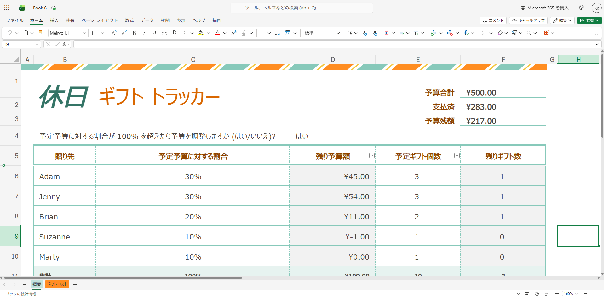
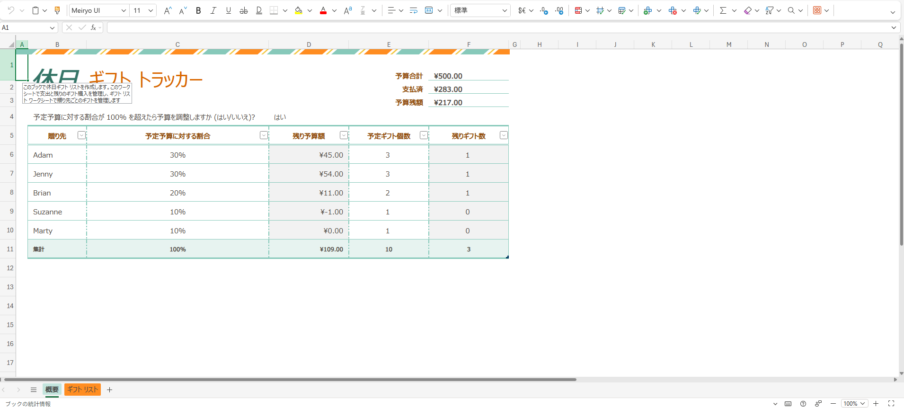

# xlreset
CLI to set Excel's initial view to cell A1 and 100% zoom.

| Before | After |
| --- | --- |
|  |  |

## Install

```sh
pipx install xlreset
```

## Usage

```sh
xlreset file.xlsx
```

The file is rewritten **in place** (no backup is created). For every sheet in
the given `.xlsx`/`.xlsm` file, xlreset sets:

- scroll position (`topLeftCell`) to `A1`
- zoom to 100% (`zoomScale` and `zoomScaleNormal`)
- the active cell/selection (`activeCell`, `sqref`) to `A1`

Everything else is left untouched.

xlreset is a CLI-only tool with no configuration flags. Feature requests?
Please [open a GitHub issue](https://github.com/RKasai127/xlreset/issues).

## License

MIT
